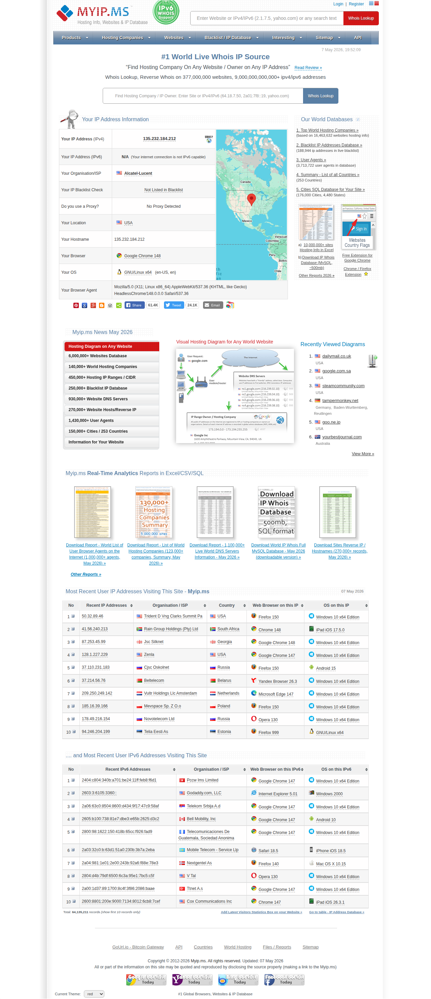

# Visited: https://myip.ms
**Time:** Thu May  7 19:53:03 UTC 2026

## Screenshot

## Raw HTML
[page.html](./page.html)

## Downloaded Media (0 files)
_No media files downloaded_

## Other Links
- [#a](#a)
- [#tab-1](#tab-1)
- [#tab-10](#tab-10)
- [#tab-2](#tab-2)
- [#tab-3](#tab-3)
- [#tab-4](#tab-4)
- [#tab-5](#tab-5)
- [#tab-6](#tab-6)
- [#tab-7](#tab-7)
- [#tab-8](#tab-8)
- [#tab-9](#tab-9)
- [//code.jquery.com/jquery-1.11.3.min.js](//code.jquery.com/jquery-1.11.3.min.js)
- [//code.jquery.com/jquery-migrate-1.2.1.min.js](//code.jquery.com/jquery-migrate-1.2.1.min.js)
- [//code.jquery.com/ui/1.11.4/jquery-ui.min.js](//code.jquery.com/ui/1.11.4/jquery-ui.min.js)
- [//pagead2.googlesyndication.com/pagead/js/adsbygoogle.js](//pagead2.googlesyndication.com/pagead/js/adsbygoogle.js)
- [/browse/api_examples/API_Json_Live_Free_Sample_Queries.html](/browse/api_examples/API_Json_Live_Free_Sample_Queries.html)
- [/browse/best_hosting/Best_Hosting_in_Best_Popular_Hosting_by_Country.html](/browse/best_hosting/Best_Hosting_in_Best_Popular_Hosting_by_Country.html)
- [/browse/blacklist/1/lastblacklistID/1/Unknown_Spam_Bot_masking_himself.html](/browse/blacklist/1/lastblacklistID/1/Unknown_Spam_Bot_masking_himself.html)
- [/browse/blacklist/Blacklist_IP_Blacklist_IP_Addresses_Live_Database_Real-time](/browse/blacklist/Blacklist_IP_Blacklist_IP_Addresses_Live_Database_Real-time)
- [/browse/cities/IP_Addresses_Cities.html](/browse/cities/IP_Addresses_Cities.html)
- [/browse/comp_browseragents/Computer_Browser_Agents.html](/browse/comp_browseragents/Computer_Browser_Agents.html)
- [/browse/comp_browsers/Computer_Browsers.html](/browse/comp_browsers/Computer_Browsers.html)
- [/browse/comp_ip/1/sort/6](/browse/comp_ip/1/sort/6)
- [/browse/comp_ip/1/sort/7](/browse/comp_ip/1/sort/7)
- [/browse/comp_ip/IPv4_Address_Database](/browse/comp_ip/IPv4_Address_Database)
- [/browse/comp_ip6/IPv6_Address_Database](/browse/comp_ip6/IPv6_Address_Database)
- [/browse/comp_os/Computer_Operating_Systems.html](/browse/comp_os/Computer_Operating_Systems.html)
- [/browse/contact/Contact_Us.html](/browse/contact/Contact_Us.html)
- [/browse/countries/Internet_Usage_Statistics_Countries.html](/browse/countries/Internet_Usage_Statistics_Countries.html)
- [/browse/dns/Sites_DNS_Nameservers](/browse/dns/Sites_DNS_Nameservers)
- [/browse/ebay_blacklist/Blacklist_Ebay_Buyers_Live_DB.html](/browse/ebay_blacklist/Blacklist_Ebay_Buyers_Live_DB.html)
- [/browse/hosts/Sites_Reverse_IP_Hosts.html](/browse/hosts/Sites_Reverse_IP_Hosts.html)
- [/browse/ip_addresses/Million_IP_Address_Ranges](/browse/ip_addresses/Million_IP_Address_Ranges)
- [/browse/ip_asn/IP_ASN.html](/browse/ip_asn/IP_ASN.html)
- [/browse/ip_blacklist/Blacklist_IPv4_v6_Addresses_User_Submitted.html](/browse/ip_blacklist/Blacklist_IPv4_v6_Addresses_User_Submitted.html)
- [/browse/ip_owners/World_IP_Address_Owners_500000.html](/browse/ip_owners/World_IP_Address_Owners_500000.html)
- [/browse/ip_ranges/IP_Ranges_by_Owner](/browse/ip_ranges/IP_Ranges_by_Owner)
- [/browse/ip_ranges6/IPv6_Ranges_by_Owner](/browse/ip_ranges6/IPv6_Ranges_by_Owner)
- [/browse/market_bitcoin/Bitcoin_Price_History_Data.html](/browse/market_bitcoin/Bitcoin_Price_History_Data.html)
- [/browse/myip/Recent_IPv4_Addresses_Visting_Site](/browse/myip/Recent_IPv4_Addresses_Visting_Site)
- [/browse/myip6/Recent_IPv6_Addresses_Visting_Site](/browse/myip6/Recent_IPv6_Addresses_Visting_Site)
- [/browse/reports/Files_Reports.html](/browse/reports/Files_Reports.html)
- [/browse/scam/Blacklist_Bot_Crawler_Types_for_Websites.html](/browse/scam/Blacklist_Bot_Crawler_Types_for_Websites.html)
- [/browse/sites/World_Websites_Database_15000000](/browse/sites/World_Websites_Database_15000000)
- [/browse/sites_deleted/Sites_Down_Deleted_Domains](/browse/sites_deleted/Sites_Down_Deleted_Domains)
- [/browse/sites_history/Sites_IP_Address_Change_History](/browse/sites_history/Sites_IP_Address_Change_History)
- [/browse/states/IP_Addresses_States_Regions.html](/browse/states/IP_Addresses_States_Regions.html)
- [/browse/web_bots/Known_Web_Bots_Web_Bots_2026_Web_Spider_List.html](/browse/web_bots/Known_Web_Bots_Web_Bots_2026_Web_Spider_List.html)
- [/browse/web_hosting/World_Hosting_Companies_DB_140000.html](/browse/web_hosting/World_Hosting_Companies_DB_140000.html)
- [/css/easydesign_red.css](/css/easydesign_red.css)

## Stats
- Links: 167
- Media: 0
